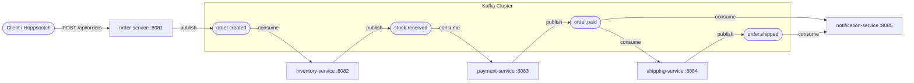
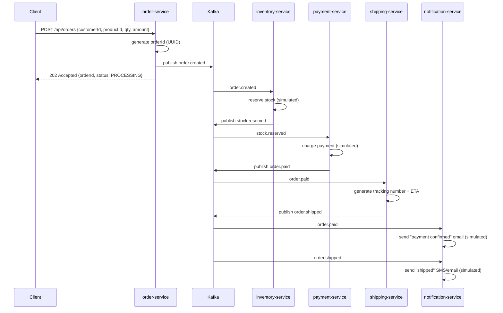

# E-Commerce Order Processing — Kafka + Spring Boot

A microservices-based e-commerce order pipeline built with **Spring Boot** and **Apache Kafka**, demonstrating event-driven architecture, service decoupling, and asynchronous processing.

---

## Tech Stack

| Category | Technology |
|---|---|
| Language | Java 25 |
| Framework | Spring Boot 3.4.5 |
| Messaging | Apache Kafka 3.9 (KRaft mode, no ZooKeeper) |
| Kafka Client | Spring Kafka |
| Serialization | JSON (Jackson) |
| Build Tool | Maven (multi-module) |
| Containerization | Podman / `apache/kafka` official image |
| API Testing | Hoppscotch |

---

## Project Structure

```
ecommerce-kafka/
├── compose.yml                 # Kafka container definition (KRaft, single node)
├── pom.xml                     # Parent Maven POM
├── common/                     # Shared event DTOs (records)
├── order-service/     :8081    # REST API — entry point, produces order.created
├── inventory-service/ :8082    # Consumes order.created → produces stock.reserved
├── payment-service/   :8083    # Consumes stock.reserved → produces order.paid
├── shipping-service/  :8084    # Consumes order.paid → produces order.shipped
└── notification-service/:8085  # Consumes order.paid + order.shipped (no further output)
```

Each service is an independent Spring Boot application with its own port, Kafka consumer group, and responsibility — they never call each other directly. All communication happens **through Kafka topics**.

---

## Why Kafka Here? (The Core Idea)

In a traditional REST-chained system, `OrderService` would call `InventoryService`, which calls `PaymentService`, which calls `ShippingService` — synchronously. If any one service is slow or down, the whole chain fails or blocks.

With Kafka:
- `order-service` just publishes an event and returns immediately (`202 Accepted`).
- Every downstream service independently **listens** for the events it cares about.
- Services can be scaled, restarted, or replaced without affecting others.
- If `shipping-service` is down, its messages simply wait in the topic until it comes back — nothing is lost.

This is the **event-driven / choreography pattern** (as opposed to a central orchestrator).

---

## High-Level Architecture



---

## Kafka Topics & Event Contracts

| Topic | Producer | Consumer(s) | Payload |
|---|---|---|---|
| `order.created` | order-service | inventory-service | `OrderCreatedEvent` (orderId, customerId, productId, quantity, amount) |
| `stock.reserved` | inventory-service | payment-service | `StockReservedEvent` (orderId, productId, quantity) |
| `order.paid` | payment-service | shipping-service, notification-service | `OrderPaidEvent` (orderId, customerId, amount, transactionId) |
| `order.shipped` | shipping-service | notification-service | `OrderShippedEvent` (orderId, customerId, trackingNumber, estimatedDelivery) |

All events are shared as Java `record` DTOs in the `common` module so every service uses the exact same contract — no duplicated classes.

Each service uses its own **consumer group** (`inventory-group`, `payment-group`, `shipping-group`, `notification-group`), so every group gets its own copy of a message (this is what allows both `shipping-service` and `notification-service` to independently consume `order.paid`).

---

## End-to-End Sequence Diagram



---

## Scenario Walkthroughs

### Scenario 1 — Happy Path
1. Client places an order → `order.created` fires.
2. Inventory reserves stock → `stock.reserved` fires.
3. Payment charges the customer → `order.paid` fires.
4. Shipping dispatches the order → `order.shipped` fires.
5. Notification sends two messages: payment confirmation and shipping update.

### Scenario 2 — A Downstream Service Is Temporarily Down
- Client places an order; `order-service` publishes `order.created` and returns `202` immediately — **the client never knows** that `payment-service` happens to be offline.
- `inventory-service` still processes and publishes `stock.reserved`.
- Kafka retains `stock.reserved` in the topic (based on retention policy).
- Once `payment-service` restarts, it resumes from its last committed **offset** and processes the backlog — no message is lost.

### Scenario 3 — Independent Scaling
- If `order.created` volume spikes, you can run multiple instances of `inventory-service` in the **same consumer group** (`inventory-group`). Kafka automatically distributes partitions across instances — each order is still processed exactly once within that group.

### Scenario 4 — Fan-Out to Multiple Services
- `order.paid` is consumed by **both** `shipping-service` and `notification-service`, because they belong to different consumer groups. This is how one event can trigger multiple independent reactions.

---

## Key Kafka Concepts Used in This Project

| Concept | Where It's Used |
|---|---|
| **Topic** | `order.created`, `stock.reserved`, `order.paid`, `order.shipped` |
| **Producer** | `KafkaTemplate` in each service's config/producer classes |
| **Consumer** | `@KafkaListener` methods in each `*EventListener` class |
| **Consumer Group** | One per service — enables independent, parallel consumption |
| **Partitioning key** | `orderId` — ensures all events for the same order stay ordered |
| **Serialization** | `JsonSerializer` / `JsonDeserializer` (Jackson) for event payloads |
| **KRaft mode** | Kafka runs without ZooKeeper (`apache/kafka:3.9.0` image) |

---

## Running the Project

### 1. Start Kafka (Podman)
```powershell
podman run -d --name kafka -p 9092:9092 `
  -e KAFKA_NODE_ID=1 `
  -e KAFKA_PROCESS_ROLES=controller,broker `
  -e KAFKA_LISTENERS="PLAINTEXT://:9092,CONTROLLER://:9093" `
  -e KAFKA_ADVERTISED_LISTENERS="PLAINTEXT://localhost:9092" `
  -e KAFKA_CONTROLLER_LISTENER_NAMES=CONTROLLER `
  -e KAFKA_LISTENER_SECURITY_PROTOCOL_MAP="CONTROLLER:PLAINTEXT,PLAINTEXT:PLAINTEXT" `
  -e KAFKA_CONTROLLER_QUORUM_VOTERS="1@localhost:9093" `
  -e KAFKA_INTER_BROKER_LISTENER_NAME=PLAINTEXT `
  -e KAFKA_AUTO_CREATE_TOPICS_ENABLE=true `
  -e KAFKA_OFFSETS_TOPIC_REPLICATION_FACTOR=1 `
  -e CLUSTER_ID=ciWo7IWazngRchmPES6q5A== `
  apache/kafka:3.9.0
```

### 2. Install the shared `common` module
```powershell
mvn install -pl common -am -DskipTests
```
> Required once (and again any time `common` changes) — see [Troubleshooting](#troubleshooting).

### 3. Run each service (5 terminals)
```powershell
cd order-service; mvn spring-boot:run
cd inventory-service; mvn spring-boot:run
cd payment-service; mvn spring-boot:run
cd shipping-service; mvn spring-boot:run
cd notification-service; mvn spring-boot:run
```

### 4. Trigger the flow (Hoppscotch / curl)
```
POST http://localhost:8081/api/orders
Content-Type: application/json

{
  "customerId": "cust-1",
  "productId": "prod-42",
  "quantity": 2,
  "amount": 199.99
}
```
Expected response: `202 Accepted` with `{ "orderId": "...", "status": "PROCESSING" }`

Watch the logs of all 4 downstream services to see the event chain fire in order.

---

## Troubleshooting

| Symptom | Cause | Fix |
|---|---|---|
| `Could not resolve dependencies for ... com.ecommerce:common` | `common` module was only built, not `install`ed to local `.m2` | Run `mvn install -pl common -am -DskipTests` |
| `405 Method Not Allowed` on `POST /api/orders` | Request sent as GET (Hoppscotch defaults new tabs to GET), or stale running instance | Confirm method dropdown is POST; restart `order-service` |
| `manifest unknown` pulling `bitnami/kafka` | Bitnami changed image tagging/registry policy | Use official `apache/kafka:3.9.0` image instead |
| `podman compose` shells out to Docker | Podman's compose shim defaults to Docker's `docker-compose.exe` if installed | Use plain `podman run` (see step 1) or install `podman-compose` (`pip install podman-compose`) |

---

## Possible Next Steps

- Add a database per service (e.g., `inventory-service` tracks real stock levels)
- Add a Dead Letter Topic (DLT) for failed message processing
- Add Kafka Streams for real-time order analytics
- Add Schema Registry (Avro) instead of raw JSON for stricter contracts
- Containerize each Spring Boot service and add them to `compose.yml`
